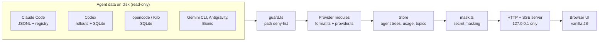

# agent-radar

A local, read-only dashboard that shows what every AI coding agent on your machine is doing right now: Claude Code, Codex, Gemini CLI, opencode, Kilo Code, Antigravity and Bionic, in one live view.

## Why I built it

Running several coding agents in parallel (and each of them spawning subagents) quickly becomes impossible to follow from terminal tabs. I wanted one place to see which sessions are alive, what each subagent is doing, how many tokens it has burned and roughly what it costs, without sending any of that data anywhere and without any risk of the monitor touching the agents' state.

## Highlights

- **Provider architecture.** Each tool is an isolated module under `src/providers/<id>/` that converts its on-disk format (JSONL transcripts, SQLite stores) into neutral types. Adding a tool is one folder and one registry line ([guide](src/providers/README.md)).
- **Subagent tree reconstruction.** Parent/child links are recovered from tool-call spawn records, task notifications and thread edges, then rendered as a live tree with state (`running`, `done`, `failed`, `stalled`), duration, model and tokens per node.
- **Incremental tailing.** Transcripts are read by byte offset and only complete lines are consumed, so large, growing files are never re-parsed. Updates reach the browser over Server-Sent Events, with polling as a fallback where file watching is unreliable.
- **Token and cost accounting.** Usage is de-duplicated per message, summed per agent, session and model, and priced from a table with its sources recorded. Unknown models show no price instead of a guess.
- **Read-only and private by design.** Credential-like files are on a deny-list and never opened, SQLite is opened read-only, the server binds to loopback only and rejects foreign `Host` headers, and everything shown passes through secret masking. A test scans the sources and fails if any filesystem-mutating API or process spawn appears outside the one allowed file.
- **Optional LLM topic summaries (off by default).** When enabled, masked excerpts of at most 2000 characters are summarized through the Codex CLI, rate-limited per hour.
- **Minimal footprint.** No build step, no database, one runtime dependency (`tsx`), vanilla JS frontend. 316 tests, with synthetic fixtures only.

## Architecture



## Quick start

Requires Node.js 22.13 or newer.

```sh
git clone https://github.com/CihanTAYLAN/agent-radar.git
cd agent-radar
npm ci
npm start
```

Open <http://localhost:4747>. Providers whose tool is not installed simply show as absent.

```sh
npm test            # vitest, fixtures only
npm run typecheck   # tsc --noEmit
```

The UI strings are in Turkish. Full details (configuration variables, WSL notes, data formats, known limitations) are in [`docs/REFERENCE.md`](docs/REFERENCE.md).

## Notes

- The agents' on-disk formats are internal and undocumented, so parsing is defensive and format knowledge is isolated in one `format.ts` per provider.
- Costs are estimates, never a bill. Agent state (for example `stalled`) is an inference from transcript activity.
- On Windows a few path-specific tests fail (the project targets Linux, macOS and WSL).

## Author

Cihan Taylan, [linkedin.com/in/cihantaylan](https://www.linkedin.com/in/cihantaylan)

Released under the [MIT License](LICENSE).
